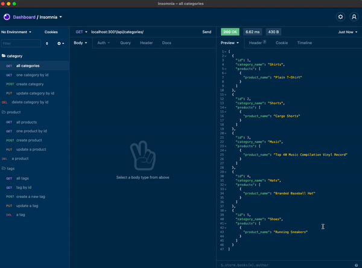

# ORM E-commerce Back End 

### Description

Objective: Build back-end portion of e-commerce site. Requires Express.js, Mysql2, Sequelize, and dontev. Install all from command line.

### Link to Video Demo

https://www.youtube.com/watch?v=vy6xLNSbYUU

 

## Languages

*JavaScript
*Node.js
*Express.js

## Made with :heart: by Zach Puckett!